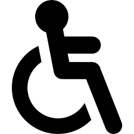

## AcessaCidades

[](https://developer.mozilla.org/pt-BR/docs/Web/HTML) [](https://developer.mozilla.org/pt-BR/docs/Web/CSS) [](https://developer.mozilla.org/pt-BR/docs/Web/JavaScript) [](https://www.w3.org/WAI/)

Aplicativo web que promove a inclusão e facilita o mapeamento de locais acessíveis na cidade. Este repositório contém a versão estática do site de apresentação do AcessaCidades, com foco em boas práticas de acessibilidade, atalhos de teclado, temas e integração com ferramentas inclusivas.

### ✨ Destaques
- **Mapeamento e divulgação** de locais acessíveis
- **Feedbacks reais** de usuários
- **Temas inclusivos**: claro, escuro, alto contraste e escala de cinza
- **Atalhos de teclado** para navegação, zoom e tipografia
- **Leitura em voz** do conteúdo da página (Speech Synthesis)
- **Integração com VLibras** para acessibilidade em Libras

## Capturas de tela


<div>





</div>

## Funcionalidades
- **Mapeamento de locais**: encontre estabelecimentos com rampas, elevadores, pisos táteis e vagas especiais
- **Rotas adaptadas**: orientação sobre melhores caminhos acessíveis
- **Acessibilidade visual**: áudio-guia e descrição de locais
- **Comunidade colaborativa**: avaliações e comentários de acessibilidade
- **Carrossel de telas** com Swiper para apresentar o app

## Acessibilidade

### Temas e modos de contraste
- Tema escuro, alto contraste, escala de cinza e reset. No site, acesse o botão "Opções de cores" no canto superior direito.

### Atalhos de teclado

| Atalho | Ação |
|---|---|
| Alt + 1 | Aumentar fonte |
| Alt + 2 | Diminuir fonte |
| Alt + 3 | Redefinir fonte |
| Alt + 4 | Ler todo o texto da página |
| Alt + S | Interromper leitura |
| Alt + 5 | Desativar/ativar animações |
| Alt + 6 | Ir para o conteúdo principal |
| Alt + 7 | Ir para o rodapé |
| Alt + 8 | Ampliar zoom |
| Alt + 9 | Reduzir zoom |
| Alt + 0 | Redefinir zoom |

## Tecnologias
- HTML5, CSS3, JavaScript
- [Swiper](https://swiperjs.com/) para o carrossel
- [VLibras](https://www.gov.br/libras/) para acessibilidade em Libras
- [Google Fonts](https://fonts.google.com/) e [Font Awesome](https://fontawesome.com/)

## Como executar localmente
1. Baixe/clonar este repositório
2. Abra o arquivo `index.html` no navegador
   - Opcional: utilize uma extensão como "Live Server" para recarregamento automático

## Estrutura do projeto

```
.
├── index.html
├── sobre.html
├── func.html
├── contato.html
├── css/
│   ├── index.css
│   ├── sobre.css
│   ├── func.css
│   └── contato.css
├── js/
│   └── script.js
└── img/
    ├── acessacidades.svg
    ├── mockup-celular.png
    ├── teste1.png, teste2.png, teste3.png
    └── ...
```

## Páginas
- `index.html`: apresentação do projeto, destaques e downloads
- `sobre.html`: propósito e depoimentos de usuários
- `func.html`: catálogo de funcionalidades do app
- `contato.html`: informações dos desenvolvedores e formulário de contato

## Desenvolvedores
- **Vinicius Siqueira de Oliveira** — FATEC Jales
- **Yuri Ribeiro Abe** — FATEC Jales


